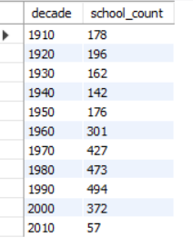
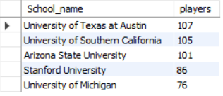
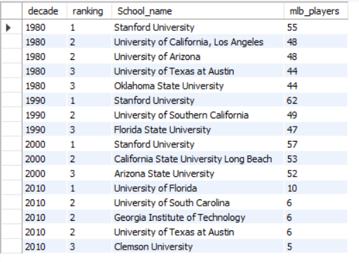
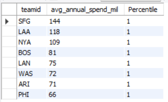
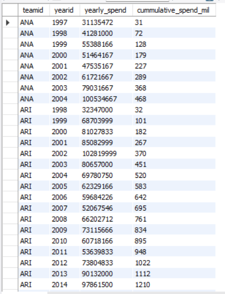
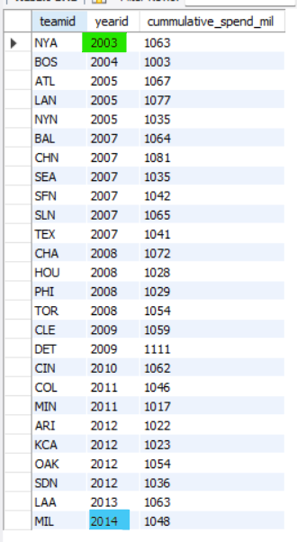
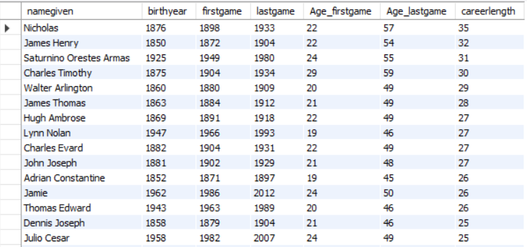

# MLB Player Analysis using MySQL


## 1. SCHOOLS: What Schools do MLB Players attend
 ### 1.1 In each decade, how many schools were there that produced MLB players?
```sql
WITH 	cte_decade AS (
SELECT	yearID, schoolID, playerid,
		FLOOR(yearID/10) * 10 AS decade
FROM	schools
ORDER BY yearID 
)
SELECT	decade,
        COUNT(distinct schoolid) as school_count
FROM	cte_decade
WHERE	decade > 1900
GROUP BY decade
ORDER BY decade;
```


 
 ### 1.2 What are the names of the top 5 schools that produced the most players?
 ```sql
with cte_school AS (
				SELECT	schoolid, count(DISTINCT playerid) AS players
				FROM	schools
				GROUP BY schoolid
				ORDER BY players desc
				)
,
cte_ranking as (
				SELECT schoolid, players,
						RANK() OVER (order by players DESC) as ranking
				FROM cte_school
				)

SELECT	b.name_full as School_name, players
FROM	cte_ranking a LEFT JOIN school_details b 
		ON a.schoolid = b.schoolid
WHERE	ranking <=5
```



 
 ### 1.3 For each decade, what were the names of the top 3 schools that produced the most players?

 ```sql
WITH cte_decade AS (
SELECT	yearID, schoolID, playerid,
        FLOOR(yearid/10)*10 as decade
FROM	schools
ORDER BY yearID 
)
, 
cte_player AS (
SELECT	decade, schoolid, count(playerid) as players
FROM 	cte_decade
GROUP BY decade, schoolid
ORDER BY decade, players desc
)
,
cte_ranking as (
SELECT	decade, schoolid, players,
		DENSE_RANK() OVER (PARTITION BY decade ORDER BY players DESC) as ranking
FROM cte_player
)

SELECT	decade, ranking, players as mlb_players, b.name_full as School_name
FROM	cte_ranking a LEFT JOIN school_details b 
		ON a.schoolid = b.schoolid
WHERE	ranking <= 3 
		AND decade > 1970
```


## 2. SALARIES: How much do teams spend on Player salaries
 ## 2.1 Return the top 20% of teams in terms of average annual spending
 ```sql
 With cte_sal AS (
 SELECT	teamid, yearid,  sum(salary) AS yearly_spend
 FROM	salaries
 GROUP BY teamid, yearid
 ORDER BY teamid
 )
 ,
 cte_team AS (
 SELECT teamid, round(AVG(yearly_spend)/1000000) as Avg_annual_spend_mil
 FROM	cte_sal
 GROUP BY teamid
 ORDER BY Avg_annual_spend_mil desc
 )
 ,
 cte_ranking as (
 SELECT teamid, avg_annual_spend, 
		NTILE(5) OVER (ORDER BY avg_annual_spend_mil DESC) as Percentile
 FROM	cte_team
 )
 
 SELECT * FROM cte_ranking
 WHERE percentile = 1
```


 ### 2.2 For each team, show the cumulative sum of spending over the years
```sql
 With cte_sal AS (
 SELECT	teamid, yearid,  sum(salary) AS yearly_spend
 FROM	salaries
 GROUP BY teamid, yearid
 ORDER BY teamid
 )
 
 SELECT teamid, yearid, yearly_spend,
		ROUND(SUM(yearly_spend) OVER (PARTITION BY teamid ORDER BY yearid) / 1000000) as cummulative_spend_mil
FROM cte_sal
ORDER BY teamid, yearid
```

 
 ### 2.3 Return the first year that each team's cumulative spending surpassed 1 billion
```sql
 With cte_sal AS (
 SELECT	teamid, yearid,  sum(salary) AS yearly_spend
 FROM	salaries
 GROUP BY teamid, yearid
 ORDER BY teamid
 )
,
cte_cummulative as ( 
SELECT teamid, yearid, yearly_spend,
		ROUND(SUM(yearly_spend) OVER (PARTITION BY teamid ORDER BY yearid) / 1000000) as cummulative_spend_mil
FROM cte_sal
 )
 ,
 cte_billion as (
 SELECT	teamid, yearid, cummulative_spend_mil,
		ROW_NUMBER() OVER (PARTITION BY teamid ORDER BY yearid) as row_num
 FROM	cte_cummulative
 WHERE	cummulative_spend_mil >= 1000
 )
 
 SELECT * from cte_billion
 WHERE row_num = 1
 ORDER BY yearid
```
 

## 3. CAREER: What does each player's career look like
 ### 3.1 For each player, calculate their age at their first (debut) game, their last game, and their career length.
 ```sql
SELECT	namegiven, birthyear, year(debut) as firstgame, year(finalgame) as lastgame,
		year(debut) - birthyear as Age_firstgame,
        year(finalgame) - birthyear as Age_lastgame,
        year(finalgame) - year(debut) as careerlength
FROM	PLAYERS
ORDER BY careerlength DESC;
```

 ### 3.2 What team did each player play on for their starting and ending years?
```sql

```

 ### 3.3 How many players started and ended on the same team and also played for over a decade?
```sql

```

## 4. SUMMARY STATS: How do player attributes compare
 ### 4.1 Which players have the same birthday?
```sql

```

 ### 4.2 Create a summary table that shows for each team, what percent of players bat right, left and both
```sql

```

 ### 4.3 How have average height and weight at debut game changed over the years, and what's the decade-over-decade difference?
 ```sql

```

 
